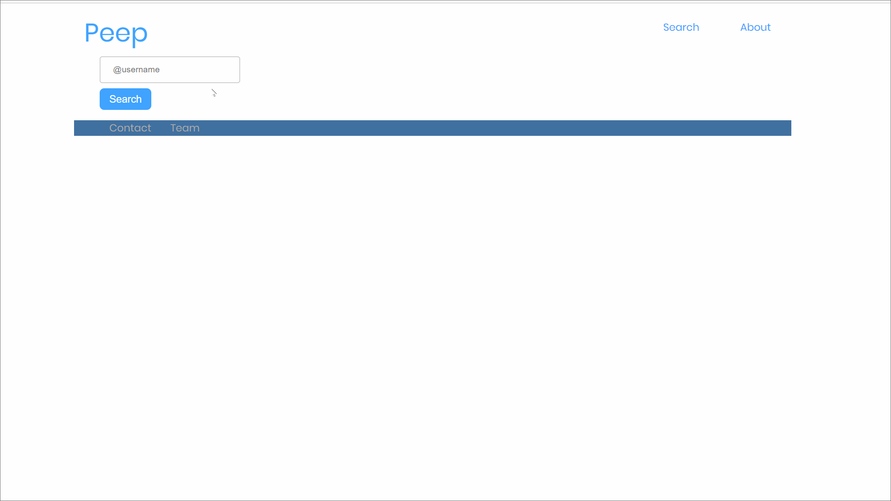

# Peep

Flask powered app that conducts a quick analysis of your tweets and allows you to easily search through your timeline.


We're still working on Peep, but feel free to check out what we have so far.



Run it locally:
This project requires Python 3.6, Flask + dependencies listed below to run.

```bash
FLASK_APP=app.py flask run
```

Or simply:

```bash
python app.py
```

## Built With

* API: [tweepy](https://tweepy.readthedocs.io/en/v3.5.0/api.html)
* Python libraries: [SQLAlchemy](https://www.sqlalchemy.org/), [flask_sqlalchemy](https://flask-sqlalchemy.palletsprojects.com/en/2.x/), [pandas](https://pandas.pydata.org/), [numpy](https://numpy.org/)
* JavaScript libraries: [D3.js](http://d3js.org/)
* Web framework: [Flask](https://flask.palletsprojects.com/en/1.1.x/)
* Database: [SQLite](https://www.sqlite.org/)


## Authors
Laura & Daisy
